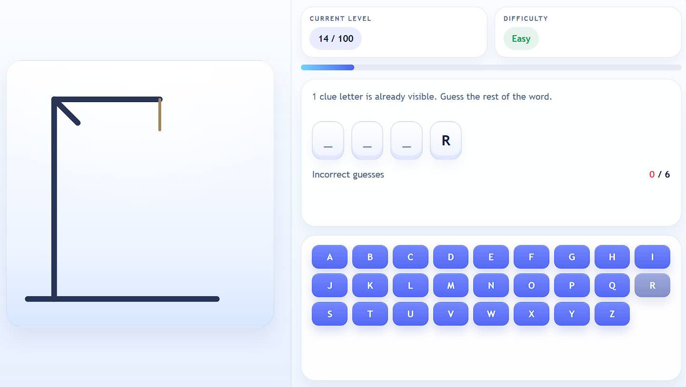
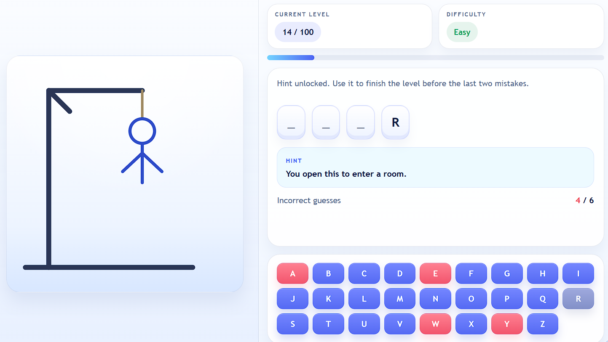
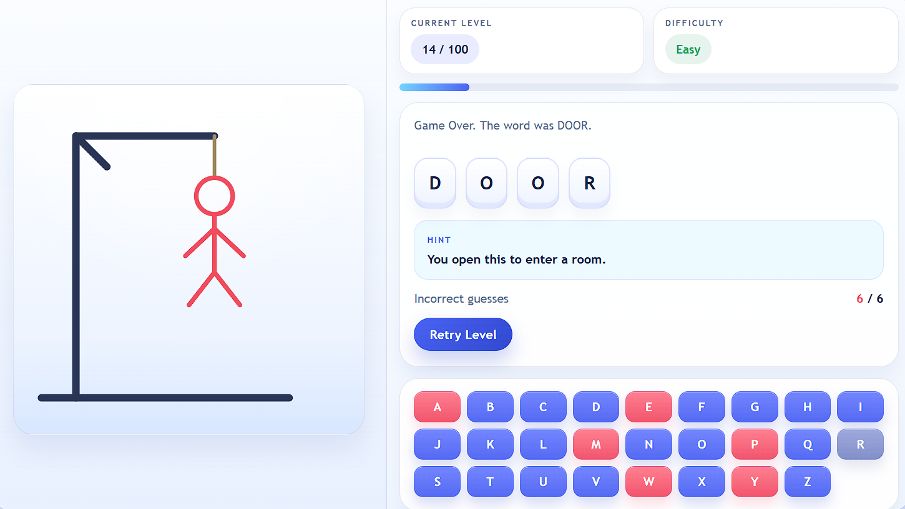

# Hangman Game


A browser-based Hangman game built with HTML, CSS, and JavaScript. The project expands the classic word-guessing format into a 100-level experience with progressive difficulty, starter clue letters, unlockable hints, and a polished desktop-first game layout.

## Play Online

[Live Demo](https://imnxr.github.io/hangman-game/)

## Screenshots

### Main Gameplay



### Hint Unlocked



### Loss State



## About The Project

This project was built as a front-end browser game with a stronger focus on presentation, structure, and game flow than a basic Hangman clone. Instead of a single replayable round, the game uses a fixed 100-level progression system that gradually increases word difficulty from short common words to longer and more challenging vocabulary.

Each round begins with clue letters already revealed, which gives the player an immediate starting point. After four wrong guesses, a contextual hint appears to help recover the level. If the player reaches six wrong guesses, the level is lost and can be retried without resetting overall progress.

## Features

- 100 hand-ordered levels
- Four difficulty tiers: Easy, Medium, Hard, and Complex
- Starter clue letters shown at the beginning of each level
- Hint unlock after 4 incorrect guesses
- Retry the current level after a loss
- Keyboard input support and on-screen controls
- Desktop-first 16:9 gameplay layout
- SVG-based hangman scene with a red fail state

## Gameplay

1. Start a level and read the visible clue letters.
2. Guess the missing letters one at a time.
3. Avoid reaching 6 incorrect guesses.
4. Use the hint once it unlocks after 4 wrong guesses.
5. Complete the word to advance to the next level.

## Difficulty Progression

- Levels 1-25: 3 to 4 letter words
- Levels 26-50: 5 to 6 letter words
- Levels 51-75: 7 to 8 letter words
- Levels 76-100: 9+ letter words

## How It Was Built

The project is split into separate files for structure, styling, and logic:

- `index.html` contains the game structure and SVG hangman scene
- `style.css` contains the layout, theme, and interface styling
- `script.js` contains the word data, game state, input handling, and render logic

The JavaScript is driven by level objects that store both a `word` and a `hint`. The UI updates dynamically based on the current level, guessed letters, number of mistakes, and win or loss state.

## Tech Stack

- HTML5
- CSS3
- Vanilla JavaScript
- SVG
- GitHub Pages
- GitHub Actions

## Technical Highlights

- Structured 100-level data setup
- State-driven rendering for gameplay updates
- Dynamic keyboard generation and input handling
- Reserved interface space for hint and controls stability
- Separate files for maintainability and cleaner project structure

## Project Structure

```text
hangman-game/
|- index.html
|- style.css
|- script.js
|- screenshots/
|  |- screenshot-desktop.png
|  |- screenshot-hint.png
|  `- screenshot-loss.png
`- .github/workflows/deploy-pages.yml
```

## Run Locally

Open `index.html` directly in a browser, or serve the folder with any static file server.

## License

This project is licensed under the MIT License.
